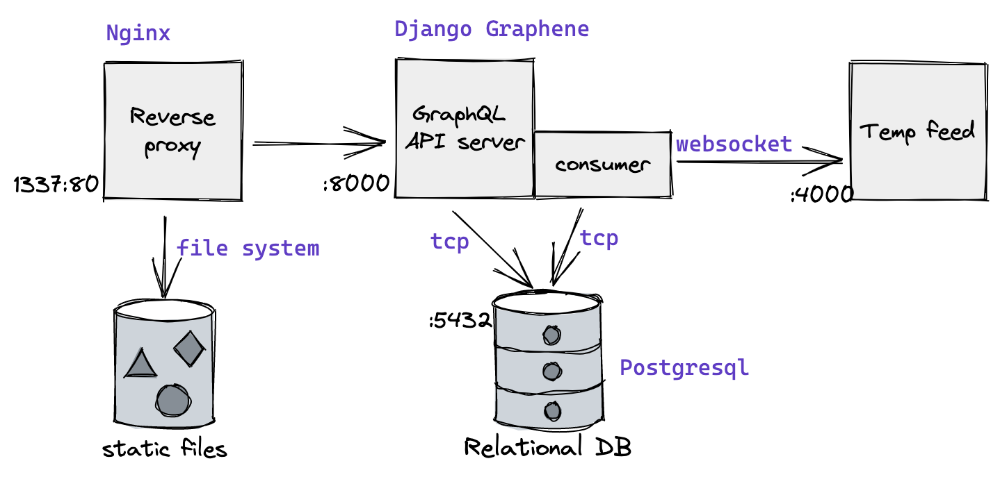

# graphql-temperature-api

Graphql API to serve temperature data coming from a temperature feed. Built on django-graphene.

**This is a proof-of-concept, do not use in production**

## Requirements

Python >= 3.8

Libraries:
```
Django>=4.0
django-environ>=0.8
graphene_django>=2.15
gunicorn>=20.1
psycopg2>=2.9
websockets>=10.1
```

## Design



The system is made of 6 main elements:

- Temperature feed: this is a container leveraging the Docker image `registry.gitlab.com/loft-orbital-hiring/temperature-feed`. With its default configuration, it emits a temperature reading every 0.5 second on port 4000

- Consumer: consume the temperature feed via `websocket` and persist the readings in the database. Implemented by a `Django` command: `python manage.py consume_feed`

- Relational database:
  - Stores the temperature readings in the Temperature table which has three columns: 

    | id | timestamp | value |

  - Stores the consumer status (on/off) in the ReadConfig table which has two columns:

    | config_key | config_value |

- GraphQL API: serve a `/graphql` endpoint to query the temperature readings stored in the database (see Usage below). 

- Reverse Proxy: handle incoming HTTP requests, serve static files from a filesystem, route queries to the GraphQL API backend.

- Static files folder: holds Django static files, for the Graphiql frontend.

## Deployment

Simple as

`docker-compose up`

This loads all containers described in the Design section.

The API is then exposed at url `http://127.0.0.1/graphql`. If put in a browser, this url gives access to a *GraphiQL* playground.

For details, see file `docker-compose.yml`

## Usage

Send Graphql requests at `http://127.0.0.1/graphql`

### Read the current temperature

Fetch the latests received temperature reading. Sample query:
```
{
  currentTemperature {
    timestamp
    value
  }
}
```
Sample response:
```
{
  "data": {
    "currentTemperature": {
      "timestamp": "2022-02-24T21:56:48.759175+00:00",
      "value": "-4.317339273491312"
    }
  }
}
```

### Get temperature statistics

Fetch the min and max temperature over a date range. Sample query:
```
{
  temperatureStatistics(after: "2022-02-11T12:00:00+00:00", before: "2022-02-25T12:00:00+00:00") {
    min
    max
  }
}
```
Sample response:
```
{
  "data": {
    "temperatureStatistics": {
      "min": "-34.175372818030716",
      "max": "34.083541127971337"
    }
  }
}
```
- input field `after` is optional. If not present, fetch all from the oldest in database.
- input field `before` is optional. If not present, fetch all to the latest in database.

### Toggle feed

Set the status of the feed consumption:
- "on": consuming
- "off": not consuming

Sample query:
```
mutation {
  toggleFeed(input: {status: "on"}) {
    status
  }
}
```
Sample response:
```
{
  "data": {
    "toggleFeed": {
      "status": "on"
    }
  }
}
```
Send `input: {status: "on"}` to turn feed consumption off. When it's turned off, emitted temperature readings are not persisted. When it's turned on again, missed readings are **not** backfilled.


## CI tooling

Code quality checks are performed automatically when code is *git-pushed* toward an open pull-request. The CI pipeline is managed by *Github-Actions*

The following jobs are performed in Python 3.8 and Python 3.9 environments:

- linting with `flake8`
- pass unit tests with 100% coverage with `pytest-django` and `pytest-cov`
- type checking with `mypy` and `django-stubs``
- pass functional (end-to-end) tests

For more details see file `.github/pr.yaml`

